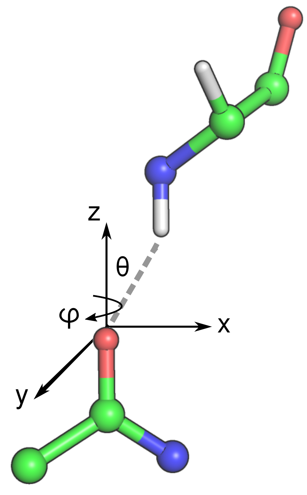

.. _hbonds-command:

``hbonds`` command
==================
The ``hbonds`` command detects and reports hydrogen bonds in molecules.
The ``hbonds`` command has the following features:

- It identifies hydrogen bonds between backbones, sidechains, subunits and
  ligands.
- It has a flexible interface to identify a wide-range of hydrogen bond types
  including *amide*, *aliphatic*, *hydroxyl* and the specification of
  arbritrary electric dipole types.
- It classifies backbone-backbone hydrogen bonds based on backbone torsion
  angles.
- Helical stretches require contiguous residues with helical backbone
  torsion angles. This prevents the misclassification of 310-helices and
  beta turns as well as isolated i+3, i+4 and i+5 hydrogen bonds.

.. include:: cmds/ml_hbonds_help.rst

.. note:: If the molecule does not have hydrogens, this command will need
          to be run with the ``--hydrogenate`` parameter. See the
          :ref:`hydrogenate <hydrogenate>` option.

Arguments
---------

``--aliphatic``
    (Optional) Include aliphatic hydrogen bonds in the results. The
    acceptor-donor atom cutoff distances are elongated to 3.0 A, and carbon
    atoms are allowed in hydrogen bond donor dipoles.

``--detailed``
    (Optional) Present a detailed report on the geometries of hydrogen
    bonds. The detailed table does not include classification information.

``--sort-type``
    (Optional) Sort the hydrogen bonds by classification type, like
    beta-sheet or alpha-helix.

Examples
--------

In this example, the hemagglutinin fusion peptide structure (``-i 2KXA``) is
downloaded, and its amide hydrogen bonds are reported.

.. include:: cmds/ml_hbonds_2kxa_1.rst

This example downloads a crystal structure of ubiquitin (``-i 1UBQ``), adds
hydrogens to the structure and shows part (``|head -n15``) of its amide
hydrogen bond report.

.. include:: cmds/ml_hbonds_1ubq_1.rst

Theory
------

Hydrogen bonds are defined between a donor dipole, which includes a hydrogen
atom, and an acceptor dipole. The acceptor and donor dipoles are more than
simple electric dipoles. The electric dipole-dipole energy is minimized when
the two dipoles are aligned colinearly (head-to-toe) with respect to each
other. Hydrogen bonds involve the sharing of a hydrogen atom between a donor
atom (N) and an acceptor atom (O) and the distribution of electron density
between these atoms and the hydrogen atom. Consequently, hydrogen bonds are
arranged according to the molecular orbitals between the donor and acceptor
atoms, rather than simply the electric potential between atoms. As a result,
optimal hydrogen bonds are askew from a standard electric dipole.

Geometry
^^^^^^^^

A hydrogen bond has an acceptor dipole and a donor dipole. The donor dipole has
a d1 donor atom (H) and a d2 donor atom (N, O or C), and the acceptor has an a1
acceptor atom (O) and an a2 acceptor atom (C). The geometry of a hydrogen bond
is defined by the distance of the d1a1 vector (:math:`d_{d1a1}`), the
:math:`\theta` angle and the :math:`\phi` angle.

    The geometry of a hydrogen bond.

:math:`d_{d1a1}` distance (in Angstroms)
    The distance between the d1 donor atom (H) and the a1 acceptor atom (O).

:math:`\theta` angle (in degrees)
    The angle between the d1a1 vector and the z-axis of the acceptor dipole.
    The z-axis of the acceptor dipole is defined by the normalized vector
    formed between the acceptor a1 and a2 atoms.

:math:`\phi` angle (in degrees)
    The angle between the d1a1 vector and the x-axis of the acceptor dipole
    plane. The acceptor dipole plane is defined by the the acceptor dipole atoms
    and the next heaviest atom bound to atom a2.

Energy and Probabilities
^^^^^^^^^^^^^^^^^^^^^^^^

The reported probabilities are determined from a histogram of the
:math:`d_{d1a1}` distance, the :math:`\theta` angle and the :math:`\phi` angle
compared to a set of *ca.* 11,300 high-resolution crystal structures in the
PDB. A high probability indicates that the measured hydrogen bond geometries
are observed frequently in high-resolution structures. Conversely, a low
probability indicates that a particular hydrogen bond geometry is rarely seen in
high-resolution structures. These are typically colored in yellow (relatively
rare) or red (very rare).

The energies represent a potential of mean force (PMF) calculated from a
Boltzmann inversion.

.. math::
    E(\Omega) = -kT ln[P(\Omega)]

The energy (in units of kT) is calculated from the Boltzmann constant and
temperature (:math:`kT`) and the probability of finding the specific
configuration, :math:`\Omega`. The configuration, in this case, is defined by
the :math:`d_{d1a1}` distance, the :math:`\theta` angle and the :math:`\phi`
angle. The energy is 0 for an ideal hydrogen bond, and it increases as the
hydrogen bond deviates from ideality--according to the probability of finding a
specific geometry in high-resolution structures.
