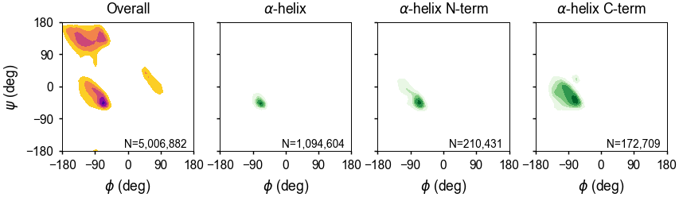
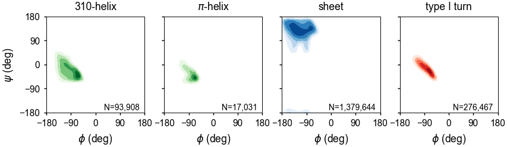
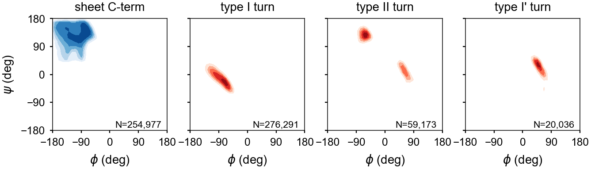
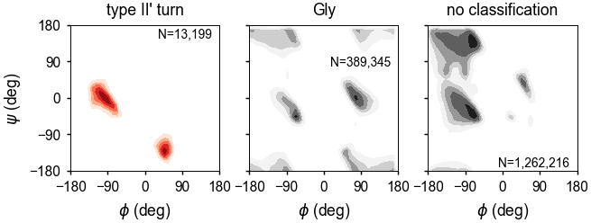

.. _measure-command:

``measure`` command
===================
The ``measure`` command is used for measuring geometries in molecules.
All of the options and preprocessors available from the :ref:`process-command`
are also available.

.. include:: output/mollib_measure_help.rst

Arguments
---------

``-d`` / ``--dist`` ``atom`` ``atom``
    Measure the distance (in Angstroms) between two atoms.

    Multiple atom pairs can used. ex: ``-d 31.N 31.CA -d 32.N 33.CA``

    Atoms must follow the standard naming conventions.
    See :ref:`atom-selectors` and :ref:`atom-filters`.

``-a`` / ``--angle``
    Measure the angle (in degrees) between three atoms.

    Multiple atom triplets can be used. ex: ``-a 31.N 31.CA 31.CB
    -a 32.N 32.CA 32.CB``

    Atoms must follow the standard naming conventions.
    See :ref:`atom-selectors` and :ref:`atom-filters`.

``-dih`` / ``--dihedral``
    Measure the dihedral angle (in degrees) between four atoms.

    Multiple atom quartets can be used. ex: ``-dih 30.C 31.N 31.CA 31.C
    -dih 31.N 31.CA 31.C 32.N``

    Atoms must follow the standard naming conventions.
    See :ref:`atom-selectors` and :ref:`atom-filters`.

    .. note:: If simple Ramachandran and side-chain
              dihedrals are needed, checkout ``--rama``.

``--stats``
    Report the average and standard deviation of all measured values. This
    option only applies to the distance, angle and dihedral measurements.

``--rama``
    Measure Ramachandran angles (in degrees) for a protein. Filters and
    options are ignored. Heteroatom chains are skipped.

    The ``--rama`` command classifies Ramachandran angles based on
    backbone-backbone amide hydrogen bonds. A residue is classified based
    on whether its amide or carbonyl is participating in a hydrogen bond.
    Residues without a classification are either randomly coil, or they
    correspond to secondary structure units at the surface of the protein,
    without an intramolecular hydrogen bond.

    The *isolated* classification is given for residues that have backbone
    hydrogen bonds, but these cannot be classified into conventional
    secondary structure units. See the :ref:`hbonds-command` for further
    details.

Atom Selectors and Filters
--------------------------

.. _atom-selectors:

Abbreviated Selectors
~~~~~~~~~~~~~~~~~~~~~

The ``measure`` methods find atoms using atom locators. Atom locators must
follow one of these conventions:

    1. (residue number).(atom name). ex: ``31.CB`` for the ``CB`` atom of
       residue number 31.
    2. (chain id).(residue number).(atom name). ex: ``A.31.CB`` for the
       ``CB`` atom of residue number 31 in chain 'A'.

Additionally, the chain id, residue number or both can be expressed as a
range using the ``:`` character:

    1. (residue range).(atom name). ex: ``31:34.CB`` for the ``CB`` atom of
       residue number 31, 32, 33 and 34.
    2. (chain range).(residue number).(atom name). ex:``A:C.34.CB`` for the
       ``CB`` atom of residue number 34 for chains 'A', 'B', 'C' and 'D'.

Finally, heteroatom chains have an asterisk appended to them. ex: 'C*'

.. note:: Atom selections may encompass hundreds of atoms, which when used
          in combination, could lead to searches over millions of
          combinations. To help improve their performance, you can either
          narrow their scope by reducing the range of chains or residue
          numbers, combine multiple :ref:`atom-filters` or use one of
          the shortcut selectors, like ``--rama`` for Ramachandran
          dihedral angles.

.. _atom-filters:

Filters
~~~~~~~

``--only-intra``
    Exclude atom selections that are *not* within the same residue.

``--exclude-intra``
    Exclude atom selections that are within the same residue.

``--only-intra-chain``
    Exclude atom selections that are *not* within the same chain.

``--exclude-intra-chain``
    Exclude atom selections that are within the same chain.

``--only-delta`` ``DELTA``
    Exclude atom selections that don't have at least one set of atoms
    with residues separated by ``DELTA`` number. This filter ignores the
    chain identifier and and may need to be combined
    with ``--filter-intra-chain`` or ``--exclude-intra-chain``.

``--only-bonded``
    Exclude atom selections that are not bonded. The bonded tests linear
    bonding relationships. For example, a dihedral with four atoms (atom1,
    atom2, atom3 and atom4) must have bonds between atom1--atom2,
    atom2--atom3 and atom3--atom4.

    .. note:: Bonded searches have to investigate the topology of each atom
              selection, which can be slower than the above filters.
              Combining the ``--only-bonded`` filter with other filters,
              like ``--only-delta 1``, can significantly speed up searches.

Examples
--------

Measuring distances
~~~~~~~~~~~~~~~~~~~

Measure :math:`\alpha`-helical HA-H distances in chain 'A' for
residues 23-49 of 2MUV, the homotetrametic influenza M2 channel. Include
statistics on the measured distances.

.. include:: output/mollib_measure_i_2MUV_d_23:49.HA_23:49.H_only-delta_3_stats.rst

Measure CA-CA distances between residue 20-21 for chains 'A', 'B', 'C'
and 'D' of 2MUV--excluding same residue distances and same chain
distances.

.. include:: output/mollib_measure_i_2MUV_d_A:D.20:21.CA_A:D.20:21.CA_exclude-intra_exclude-intra-chain.rst

Compare the distance between the HA of residue 5 and the H of residue
21 for two different structures, 2KXA and 2LWA. The 2KXA structure
represents the wildtype hemagglutinin fusion peptide (HAfp) in the
*closed* helical-hairpin structure, placing these two atoms in close
promixity. The 2LWA structure represents the conformational ensemble
of the HAfp-G8A mutant with a closed structure (chain 'A'), a
semi-closed structure (chain 'B') and an open structure (chain 'C').

.. include:: output/mollib_measure_i_2KXA_2LWA_d_A:C.5.HA_A:C.21.H_only-intra-chain.rst

Measuring Angles
~~~~~~~~~~~~~~~~

Measure the angle of the bonded 'C-1'--'N'--'H' atoms for residues
20-30 from the ubiquitin structure 2MJB.

.. include:: output/mollib_measure_i_2MJB_a_20:30.C_20:30.N_20:30.H_only-bonded.rst

Measuring Dihedrals
~~~~~~~~~~~~~~~~~~~

The following example measures the :math:`\phi` angle for residues 2-6 of the
hemagglutinin fusion peptide domain (2KXA).

.. include:: output/mollib_measure_i_2KXA_dih_2:6.C_2:6.N_2:6.CA_2:6.C_only-bonded_stats.rst

Ramachandran Angles
~~~~~~~~~~~~~~~~~~~

Measure the Ramachandran :math:`\phi` and :math:`\psi` angles for the
hemagglutinin fusion peptide structure 2KXA.

.. include:: output/mollib_measure_i_2KXA_rama.rst

Approach to Secondary Structure Assignments
-------------------------------------------

:math:`\beta` Turns
~~~~~~~~~~~~~~~~~~~

Turns are defined by a hydrogen bond between residues 'i' and 'i+4' as well as
the backbone torsion angles for residues 'i+1' and 'i+2'. The turn type is
based on the torsion angles of the 'i+1' and 'i+2' residues.

===== ================== ================== ================== ==================
Type  :math:`\phi_{i+1}` :math:`\psi_{i+1}` :math:`\phi_{i+2}` :math:`\psi_{i+2}`
===== ================== ================== ================== ==================
I     -60º                -30º              -90º               0º
I'     60º                 30º               90º               0º
II    -60º                120º               80º               0º
II'    60º               -120º              -80º               0º
===== ================== ================== ================== ==================

Assignments of the turn residues 'i+1' and 'i+2' are made. However, since
the torsion angles of the terminal residues--specifically :math:`\phi` of
residue 'i' and :math:`\psi` of residue 'i+4'--are flexible, these are not
included in the assignment.

Helices
~~~~~~~

Helices consist of stretches of hydrogen bonded residues with helical dihedrals.
3:sub:`10`-helices are typically short, with one or more 'i'-'i+3'hydrogen
bonds, and these can be mischaracterized as turns (type I turns). In this case,
mollib checks that all residues in the helix ('i' through 'i+3') have helical
dihedral angles.

Sheets
~~~~~~

Sheets are first identified by finding hydrogen bonds between residues with
sheet torsion angles. This process identifies most sheet residues. However, for
strands on the edges of sheets, every second amino acid may not form an
internal hydrogen bond.

To accurately identify sheet strands, mollib will find groups of sheet hydrogen
bonds, then it will evaluate whether the residues are in a checkered pattern and
whether the previous or subsequent residues have sheet backbone torsion angles.
Thereafter, it will assign all residues in the group to a sheet classification,
if no other classification has already been made. See :ref:`fill gaps
<measure-fill-gaps>` for details.

.. _measure-fill-gaps:

Fill Gaps
~~~~~~~~~

Secondary structure assignments are made based on hydrogen bonds. In some cases,
such as the edge strands of sheets or short 310-helices, residues within a
contiguous block are not assigned because they do not form an internal hydrogen
bond. The ``fill_gaps`` function will find contiguous blocks of secondary
structure units, test the dihedral of residues within that block, and make an
assignment of the whole block.

For example, ``fill_gaps`` will assign a checkered sheet assignment ('E E E E
E') to a contiguous ß-strand ('EEEEEEEEE') if all residues in the block
have ß-strand backbone dihedral angles. 310-helices are another example in
which the 'i' and 'i+3' residues are hydrogen bonded, yet the 'i+1' and 'i+2'
residues are not. In this case, the gap will be filled by assigning residues 'i'
through 'i+3' as 310-helix, if all four residues have helical dihedral angles.

By default, filling gaps will not overwrite secondary structure assignments for
residues that already have an assignment.

Potential of Mean Force Plots
~~~~~~~~~~~~~~~~~~~~~~~~~~~~~

The backbone dihedral probabilities and energies are calculated from potential
of mean force plots for each type of secondary structure. It is calculated from
the probability of finding a particular set of dihedral angles in a group of
high-resolution structures. A high probability indicates that the measured
dihedral angles are observed frequently in high-resolution structures.
Conversely, a low probability indicates that a particular set of dihedral angles
is rarely seen in high-resolution structures. These are typically colored in
yellow (relatively rare) or red (very rare).

The energies represent a potential of mean force (PMF) calculated from a
Boltzmann inversion.

.. math::
    E(\Omega) = -kT ln[P(\Omega)]

The energy is zero when a set of dihedrals angles is optimal for a given type
of secondary structure classification. The following are the energy plots for
each secondary structure classification.

